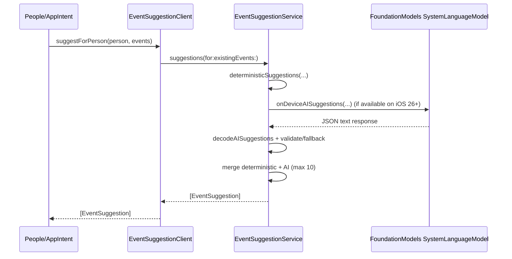

# AI (IA) Usage in Linnet

This document explains how AI is used today in the app.

## Scope

AI is currently used only for **event suggestion generation** in `EventSuggestionService`.

- Deterministic suggestions are always generated first.
- On-device AI suggestions are added only if `FoundationModels` is available and supported.
- Final suggestions are merged and deduplicated by normalized title.

## Runtime Behavior

## AI Provider and Constraints

- Provider: `FoundationModels.SystemLanguageModel.default` (on-device).
- Availability gate:
  - `canImport(FoundationModels)`
  - iOS/macOS/visionOS 26+
  - Model availability + locale support.
- Prompt constraints enforce:
  - Up to 3 suggestions.
  - JSON-only format.
  - Practical/respectful ideas.
  - Coherent recurrence and reminder offsets.
  - No duplicate ideas from existing events.

## Fallback Strategy

If any step fails (framework unavailable, model unavailable, response decode failure, etc.):

- AI suggestions become `[]`.
- Deterministic suggestions still power the feature.
- The user still gets suggestions.

## Where It Is Used

- In-app flows through `EventSuggestionClient` (for people suggestions).
- AppIntents:
  - `SuggestEventsForPersonIntent`
  - `AddSuggestedEventForPersonIntent`

## Privacy Characteristics

- AI suggestions are generated on-device via `FoundationModels`.
- No external LLM endpoint is called by this service.

## Analytics

Suggestion flows log:

- `suggestions_generated`
- `suggestion_applied`

