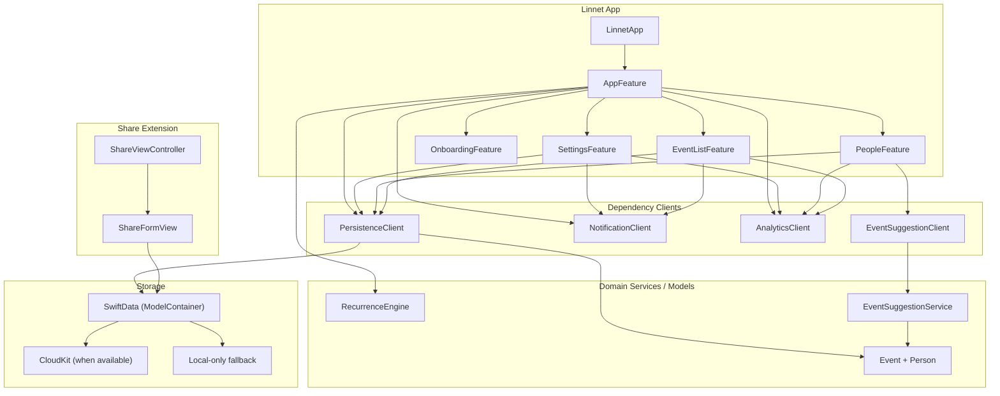

# Linnet Architecture

This document describes the current high-level architecture of the app and its main runtime flows.

## Overview

Linnet is structured around:

- `ComposableArchitecture` reducers/features for app behavior.
- Dependency-injected clients for persistence, notifications, analytics, and suggestions.
- `SwiftData` as the persistence layer, with CloudKit-backed sync when available.
- A Share Extension that writes events into the same data model/container.

## Startup Flow

1. `LinnetApp` builds a `PersistenceClient`.
2. If launched with screenshot flags, it uses mocked data.
3. Otherwise, it creates a `ModelContainer` through `SharedContainer.makeModelContainer()`.
4. The store is created with `AppFeature` and injected dependencies.
5. On app launch action, notifications are re-scheduled for enabled events and analytics are logged.

## Data and Extension Integration

- App and Share Extension both rely on the same schema (`EventEntity`, `PersonEntity`) via `SharedContainer`.
- The extension can create events directly, which then become visible in the main app.
