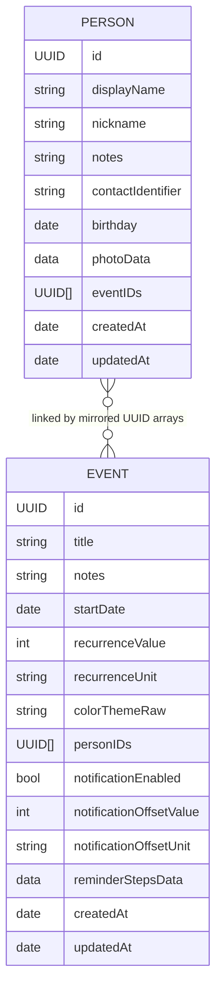
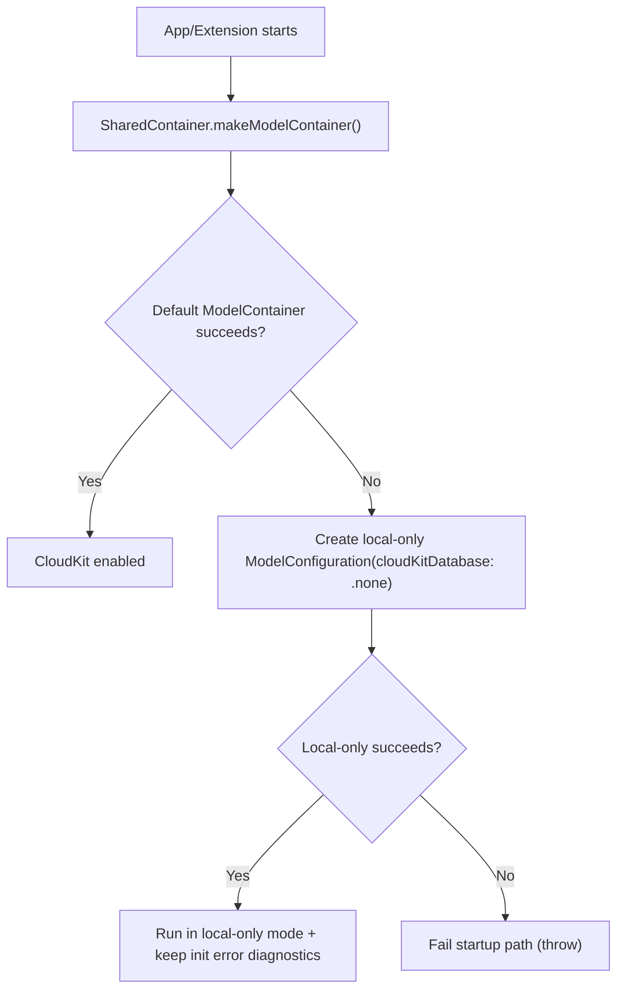
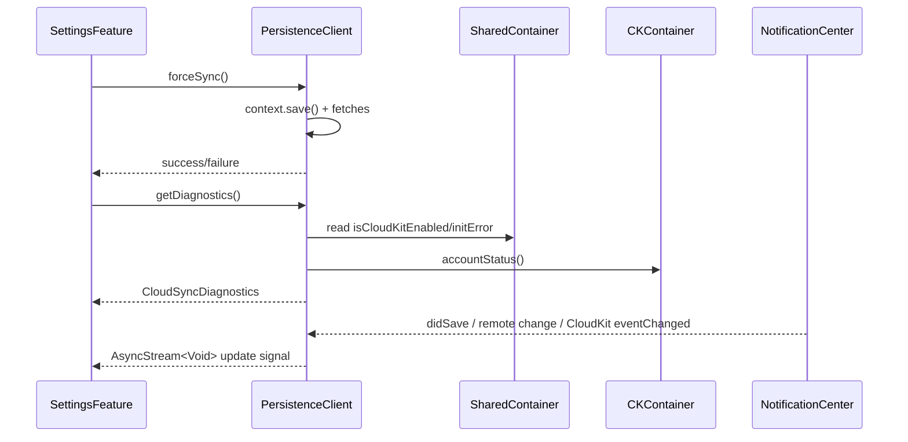

# Model Relationships and CloudSync

This document explains how `Person` and `Event` relate, and how CloudKit sync is wired through SwiftData.

## Data Model Relationship

The domain is many-to-many between people and events.

Implementation detail: relationships are mirrored through UUID arrays (not native SwiftData relationship properties):

- `EventEntity.personIDsData` stores `[UUID]` as JSON.
- `PersonEntity.eventIDsData` stores `[UUID]` as JSON.

## Consistency Rules

`PersistenceClient.live` keeps both sides aligned:

- Saving an event updates affected `PersonEntity.eventIDs`.
- Saving a person updates affected `EventEntity.personIDs`.
- Deleting either side removes stale IDs from the opposite side.

This guarantees bidirectional consistency even without explicit ORM relationships.

## CloudSync Design

`SharedContainer.makeModelContainer()` tries CloudKit-backed storage first, then falls back to local-only storage if initialization fails.

## Sync and Diagnostics Flow

`PersistenceClient` exposes:

- `observeRemoteChanges()` via:
  - `ModelContext.didSave`
  - `.NSPersistentStoreRemoteChange`
  - `NSPersistentCloudKitContainer.eventChangedNotification`
- `forceSync()` (save + fetch roundtrip)
- `getDiagnostics()` (mode, store URL, iCloud account status, event count, init error)

